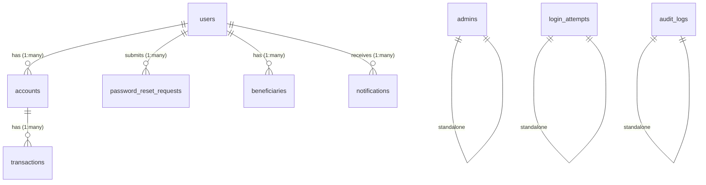

# SecureBank NetBanking — Complete Project Analysis

## 1. Folder Structure

```
netbanking/
├── index.php                          # Root redirect → user/login.php
├── testhash.php                       # Dev utility — generates bcrypt hash
├── ReadMe.txt                         # Project information
│
├── config/
│   ├── db.php                         # DB connection + app constants
│   ├── session.php                    # Session bootstrap + auth guards
│   ├── schema.sql                     # Full DB schema + seed admin
│   └── migration_v2.sql               # Database migration script
│
├── includes/
│   └── functions.php                  # Shared helper functions
│
├── admin/
│   ├── auth.php                       # Admin auth guard (include file)
│   ├── login.php                      # Admin login form + handler
│   ├── logout.php                     # Admin session destroy
│   ├── dashboard.php                  # Stats overview (users, accounts, txns, balance)
│   ├── users.php                      # List users + toggle block/unblock
│   ├── accounts.php                   # List all accounts with balances
│   ├── transactions.php              # List all bank transactions
│   ├── password_requests.php         # View password reset requests
│   ├── set_password.php              # Set new password for a reset request
│   ├── change_password.php           # Admin changes own password
│   └── partials/
│       └── sidebar.php               # Admin sidebar navigation
│
├── user/
│   ├── login.php                      # User login with brute-force protection
│   ├── register.php                   # User registration + account creation
│   ├── logout.php                     # User session destroy
│   ├── dashboard.php                  # Balance, recent txns, cash flow, profile
│   ├── deposit.php                    # Deposit money (PIN-verified)
│   ├── withdraw.php                   # Withdraw money (PIN-verified, min-balance)
│   ├── transfer.php                   # Transfer to another account (PIN-verified)
│   ├── statement.php                  # Full transaction history with filters
│   ├── change_pin.php                # Change 4-digit transaction PIN
│   ├── forgot_password.php           # Submit password reset request
│   └── partials/
│       └── sidebar.php               # User sidebar navigation
│
└── assets/
    ├── theme.css                      # Legacy/unused base theme
    ├── css/
    │   ├── premium-theme.css          # CSS variables + base component styles
    │   └── app-theme.css              # Full layout system (sidebar, tables, forms, etc.)
    └── js/
        └── animations.js             # Single fade-in animation on DOMContentLoaded
```

---

## 2. Database Schema (9 Tables)

### `users`
| Column      | Type             | Constraints                          |
|-------------|------------------|--------------------------------------|
| user_id     | INT AUTO_INCREMENT | PRIMARY KEY                        |
| full_name   | VARCHAR(100)     | NOT NULL                             |
| email       | VARCHAR(150)     | NOT NULL, UNIQUE                     |
| phone       | VARCHAR(15)      | NOT NULL, UNIQUE                     |
| username    | VARCHAR(50)      | NOT NULL, UNIQUE                     |
| password    | VARCHAR(255)     | NOT NULL (bcrypt)                    |
| status      | ENUM('active','blocked') | DEFAULT 'active'             |
| created_at  | TIMESTAMP        | DEFAULT CURRENT_TIMESTAMP            |

### `accounts`
| Column         | Type             | Constraints                       |
|----------------|------------------|-----------------------------------|
| account_id     | INT AUTO_INCREMENT | PRIMARY KEY                     |
| user_id        | INT              | NOT NULL, FK → users(user_id) ON DELETE CASCADE |
| account_number | VARCHAR(20)      | NOT NULL, UNIQUE                  |
| balance        | DECIMAL(15,2)    | NOT NULL, DEFAULT 0.00            |
| pin            | VARCHAR(255)     | NOT NULL (bcrypt)                 |
| status         | ENUM('active','frozen','closed') | DEFAULT 'active' |
| created_at     | TIMESTAMP        | DEFAULT CURRENT_TIMESTAMP         |

### `transactions`
| Column         | Type             | Constraints                       |
|----------------|------------------|-----------------------------------|
| transaction_id | INT AUTO_INCREMENT | PRIMARY KEY                     |
| account_id     | INT              | NOT NULL, FK → accounts(account_id) ON DELETE CASCADE |
| type           | ENUM('deposit','withdraw','transfer_in','transfer_out') | NOT NULL |
| amount         | DECIMAL(15,2)    | NOT NULL                          |
| balance_after  | DECIMAL(15,2)    | NOT NULL                          |
| reference_no   | VARCHAR(30)      | NOT NULL, UNIQUE                  |
| note           | VARCHAR(255)     | DEFAULT NULL                      |
| created_at     | TIMESTAMP        | DEFAULT CURRENT_TIMESTAMP         |

### `admins`
| Column     | Type             | Constraints                        |
|------------|------------------|------------------------------------|
| admin_id   | INT AUTO_INCREMENT | PRIMARY KEY                      |
| username   | VARCHAR(50)      | NOT NULL, UNIQUE                   |
| password   | VARCHAR(255)     | NOT NULL (bcrypt)                  |
| full_name  | VARCHAR(100)     | NOT NULL                           |
| role       | ENUM('superadmin','admin') | DEFAULT 'admin'          |
| created_at | TIMESTAMP        | DEFAULT CURRENT_TIMESTAMP          |

### `login_attempts` (brute-force protection)
| Column       | Type         | Constraints                    |
|--------------|--------------|--------------------------------|
| id           | INT AUTO_INCREMENT | PRIMARY KEY                |
| username     | VARCHAR(50)  | NOT NULL                       |
| ip_address   | VARCHAR(45)  | NOT NULL                       |
| attempted_at | TIMESTAMP    | DEFAULT CURRENT_TIMESTAMP      |

### `password_reset_requests`
| Column         | Type             | Constraints                     |
|----------------|------------------|---------------------------------|
| request_id     | INT AUTO_INCREMENT | PRIMARY KEY                   |
| user_id        | INT              | NOT NULL, FK → users(user_id) ON DELETE CASCADE |
| account_number | VARCHAR(20)      | NOT NULL                        |
| phone          | VARCHAR(15)      | NOT NULL                        |
| status         | ENUM('pending','approved','rejected') | DEFAULT 'pending' |
| created_at     | TIMESTAMP        | DEFAULT CURRENT_TIMESTAMP       |

### `audit_logs`
| Column | Type | Constraints |
|---|---|---|
| log_id | INT AUTO_INCREMENT | PRIMARY KEY |
| actor_type | ENUM('user', 'admin', 'system') | NOT NULL |
| actor_id | INT | DEFAULT NULL |
| action | VARCHAR(100) | NOT NULL |
| details | TEXT | DEFAULT NULL |
| ip_address | VARCHAR(45) | NOT NULL |
| created_at | TIMESTAMP | DEFAULT CURRENT_TIMESTAMP |

### `beneficiaries`
| Column | Type | Constraints |
|---|---|---|
| beneficiary_id | INT AUTO_INCREMENT | PRIMARY KEY |
| user_id | INT | NOT NULL, FK → users(user_id) ON DELETE CASCADE |
| account_number | VARCHAR(20) | NOT NULL |
| beneficiary_name | VARCHAR(100) | NOT NULL |
| nickname | VARCHAR(50) | DEFAULT NULL |
| created_at | TIMESTAMP | DEFAULT CURRENT_TIMESTAMP |

### `notifications`
| Column | Type | Constraints |
|---|---|---|
| notification_id | INT AUTO_INCREMENT | PRIMARY KEY |
| user_id | INT | NOT NULL, FK → users(user_id) ON DELETE CASCADE |
| title | VARCHAR(150) | NOT NULL |
| message | TEXT | NOT NULL |
| type | ENUM('info', 'success', 'warning', 'danger') | DEFAULT 'info' |
| is_read | TINYINT(1) | DEFAULT 0 |
| created_at | TIMESTAMP | DEFAULT CURRENT_TIMESTAMP |

---

## 3. Entity Relationships



- **users → accounts**: One user can have multiple accounts (1:N), though current registration creates exactly 1 account per user.
- **accounts → transactions**: Each transaction belongs to exactly one account (1:N).
- **users → password_reset_requests**: A user can submit multiple reset requests (1:N), but only one `pending` at a time (enforced in code, not DB).
- **users → beneficiaries**: A user can save multiple beneficiaries for quick transfers (1:N).
- **users → notifications**: A user can receive multiple system notifications (1:N).
- **admins**: Standalone table, no FK relationships.
- **login_attempts**: Standalone log table, no FKs.
- **audit_logs**: Standalone log table for tracking system-wide activity, no FKs.

---

## 4. Existing Features

### User Panel Features
| Feature | File | Description |
|---------|------|-------------|
| **Registration** | [register.php](file:///c:/xampp/htdocs/netbanking/user/register.php) | Full name, email, phone, username, password, 4-digit PIN. Auto-generates 10-digit account number. Client-side + server-side validation. |
| **Login** | [login.php](file:///c:/xampp/htdocs/netbanking/user/login.php) | Username + password auth. Brute-force protection (5 attempts / 15 min window per IP+username). Blocked user detection. Session timeout handling. |
| **Dashboard** | [dashboard.php](file:///c:/xampp/htdocs/netbanking/user/dashboard.php) | Time-based greeting, balance with show/hide toggle, copy account number, monthly income/expense with progress bars, last 5 transactions, profile summary. |
| **Deposit** | [deposit.php](file:///c:/xampp/htdocs/netbanking/user/deposit.php) | PIN-verified deposit. Min ₹100. Generates reference number. Updates balance + creates transaction record. |
| **Withdraw** | [withdraw.php](file:///c:/xampp/htdocs/netbanking/user/withdraw.php) | PIN-verified withdrawal. Min ₹100. Checks sufficient balance. Enforces ₹500 minimum remaining balance. |
| **Transfer** | [transfer.php](file:///c:/xampp/htdocs/netbanking/user/transfer.php) | PIN-verified inter-account transfer. Self-transfer blocked. Validates receiver account exists and is active. Creates dual transaction records (transfer_out + transfer_in). Min ₹100, min balance ₹500. |
| **E-Statement** | [statement.php](file:///c:/xampp/htdocs/netbanking/user/statement.php) | Full transaction history with type-based filter chips (All, Deposits, Withdrawals, Sent, Received). Shows reference, type, amount, balance after, note, date. |
| **Change PIN** | [change_pin.php](file:///c:/xampp/htdocs/netbanking/user/change_pin.php) | Change 4-digit transaction PIN. Verifies old PIN. Prevents reuse of same PIN. |
| **Forgot Password** | [forgot_password.php](file:///c:/xampp/htdocs/netbanking/user/forgot_password.php) | Submits reset request with phone + account number. Prevents duplicate pending requests. Admin-reviewed workflow. |
| **Logout** | [logout.php](file:///c:/xampp/htdocs/netbanking/user/logout.php) | Destroys session, redirects to login. |

### Admin Panel Features
| Feature | File | Description |
|---------|------|-------------|
| **Login** | [login.php](file:///c:/xampp/htdocs/netbanking/admin/login.php) | Username + password auth (no brute-force protection). |
| **Dashboard** | [dashboard.php](file:///c:/xampp/htdocs/netbanking/admin/dashboard.php) | Stats: total users, accounts, transactions, total balance held. Quick action links. |
| **Manage Users** | [users.php](file:///c:/xampp/htdocs/netbanking/admin/users.php) | List all users with account numbers. Toggle block/unblock with confirmation. |
| **View Accounts** | [accounts.php](file:///c:/xampp/htdocs/netbanking/admin/accounts.php) | List all accounts with balance and status. |
| **View Transactions** | [transactions.php](file:///c:/xampp/htdocs/netbanking/admin/transactions.php) | Bank-wide transaction log with type icons and formatted amounts. |
| **Password Requests** | [password_requests.php](file:///c:/xampp/htdocs/netbanking/admin/password_requests.php) | List all password reset requests. Pending ones link to "Set Password" page. |
| **Set Password** | [set_password.php](file:///c:/xampp/htdocs/netbanking/admin/set_password.php) | Admin sets a new password for a user's reset request. Marks request as 'approved'. |
| **Change Password** | [change_password.php](file:///c:/xampp/htdocs/netbanking/admin/change_password.php) | Admin changes own login password. Min 6 chars. |
| **Logout** | [logout.php](file:///c:/xampp/htdocs/netbanking/admin/logout.php) | Destroys session, redirects to admin login. |

---

## 5. Authentication System

### User Authentication Flow
1. **Session Start**: [session.php](file:///c:/xampp/htdocs/netbanking/config/session.php) — includes `db.php`, starts session, defines guard functions.
2. **Guard**: `requireUserLogin()` — checks `$_SESSION['user_id']` + `$_SESSION['user_logged_in']`. Enforces 30-min inactivity timeout (`SESSION_TIMEOUT = 1800`).
3. **Login**: Validates credentials → checks blocked status → sets `user_id`, `user_name`, `user_logged_in`, `last_activity`.
4. **Brute-force**: `isLockedOut()` counts failed attempts in 15-min window per username+IP. Max 5 attempts. `logFailedAttempt()` records each failure.
5. **Redirect helpers**: `redirectIfUserLoggedIn()` prevents logged-in users from seeing login/register pages.

### Admin Authentication Flow
1. **Guard**: `requireAdminLogin()` — checks `$_SESSION['admin_id']` + `$_SESSION['admin_logged_in']`. Same 30-min timeout.
2. **Login**: No brute-force protection (unlike user login). Sets `admin_id`, `admin_name`, `admin_logged_in`, `last_activity`.
3. **Auth include**: [admin/auth.php](file:///c:/xampp/htdocs/netbanking/admin/auth.php) — simple wrapper that requires session + functions + calls `requireAdminLogin()`.

### Password Storage
- All passwords (user, admin) and PINs hashed with `PASSWORD_BCRYPT` via `password_hash()`.
- Verified with `password_verify()` via wrapper `verifyPassword()`.

---

## 6. Transaction System

### Transaction Types
| Type | Direction | Color Code | Created By |
|------|-----------|------------|------------|
| `deposit` | IN (+) | Green (#00ffa3) | `deposit.php` |
| `withdraw` | OUT (-) | Red (#ff3e6c) | `withdraw.php` |
| `transfer_in` | IN (+) | Green (#00ffa3) | `transfer.php` (receiver side) |
| `transfer_out` | OUT (-) | Red (#ff3e6c) | `transfer.php` (sender side) |

### Business Rules
- **Minimum transaction amount**: ₹100 (all types)
- **Minimum balance**: ₹500 must remain after withdraw/transfer
- **PIN verification**: Required for deposit, withdraw, transfer
- **Self-transfer**: Blocked
- **Receiver validation**: Must exist and be `active`
- **Reference numbers**: Format `TXN` + `YYYYMMDD` + 6-char uniqid suffix
- **Account numbers**: Format `100` + 7 random digits (10 digits total)

### Transfer Atomicity
> [!WARNING]
> Transfers are **NOT wrapped in a database transaction**. The 4 operations (debit sender, credit receiver, insert sender txn, insert receiver txn) execute as separate statements. A crash mid-way could leave inconsistent state.

---

## 7. Password Reset System

### Flow
1. **User** goes to [forgot_password.php](file:///c:/xampp/htdocs/netbanking/user/forgot_password.php) → enters phone + account number.
2. System verifies the phone+account combo matches a real user (JOIN on `users` + `accounts`).
3. Checks for existing `pending` request for that user — prevents duplicates.
4. Inserts into `password_reset_requests` with status `pending`.
5. **Admin** views [password_requests.php](file:///c:/xampp/htdocs/netbanking/admin/password_requests.php) — sees all requests.
6. Clicks "Set Password" on a pending request → goes to [set_password.php](file:///c:/xampp/htdocs/netbanking/admin/set_password.php).
7. Admin enters a new password → system updates user's password + marks request as `approved`.

> [!NOTE]
> There is no "reject" action in the UI — admins can only approve (set password). The `rejected` enum value exists in the schema but is never used.

---

## 8. Design & Styling System

- **CSS Variables** defined in [premium-theme.css](file:///c:/xampp/htdocs/netbanking/assets/css/premium-theme.css): `--bg-dark`, `--bg-card`, `--primary-glow`, `--accent-blue`, `--text-main`, `--text-muted`, `--border-color`.
- **Layout system** in [app-theme.css](file:///c:/xampp/htdocs/netbanking/assets/css/app-theme.css): 260px sidebar + fluid main content grid.
- **Login/register/forgot-password pages** use **inline `<style>` tags** with Bootstrap 5.3.0 + Font Awesome 6.4.0 from CDN.
- **Dashboard pages** (user & admin) use the shared CSS files — no Bootstrap, no inline styles for layout.
- **Dark theme** throughout — navy/blue color palette with cyan/green/red accents.
- [theme.css](file:///c:/xampp/htdocs/netbanking/assets/theme.css) appears to be a legacy file — not imported by any active page.
- [animations.js](file:///c:/xampp/htdocs/netbanking/assets/js/animations.js) — adds `fade-in` class to body on load, but no corresponding CSS `fade-in` animation exists. Currently non-functional.

---

## 9. Coding Patterns & Conventions

| Aspect | Pattern |
|--------|---------|
| **DB API** | Procedural `mysqli_*` functions (not OOP, not PDO) |
| **Prepared Statements** | Used consistently via `mysqli_prepare` / `bind_param` / `execute` |
| **Input Sanitization** | `sanitize()` = `htmlspecialchars(strip_tags(trim()))` |
| **Output Escaping** | `htmlspecialchars()` used on most outputs; some raw echoes exist |
| **Session Management** | Centralized in `config/session.php` |
| **Page Layout** | Set `$active` variable → include sidebar partial → render page |
| **Flash Messages** | `setFlash()` / `getFlash()` / `showFlash()` via session |
| **Error Handling** | `$error` / `$success` local variables per page |
| **Password Hashing** | `password_hash(PASSWORD_BCRYPT)` via `hashPassword()` |
| **Currency Formatting** | `formatCurrency()` = `₹` + `number_format($amt, 2)` |
| **Helper Duplication** | `txnMeta()` is defined independently in 3 files (dashboard, statement, admin/transactions) |

---

## 10. Notable Observations

> [!IMPORTANT]
> ### Things to preserve
> - All 6 database tables and their column names
> - Prepared statement pattern throughout
> - bcrypt hashing for passwords and PINs
> - Session-based auth with timeout
> - Brute-force protection on user login
> - Business rules (₹100 min, ₹500 min balance, self-transfer block)
> - Dual transaction records for transfers (transfer_in + transfer_out)
> - The `$active` sidebar highlighting pattern
> - Dark theme design language

> [!NOTE]
> ### Potential areas for enhancement (not changing now)
> - Transfer operations lack DB transaction wrapping (atomicity risk)
> - `txnMeta()` helper duplicated in 3 files — could be centralized
> - Admin login has no brute-force protection
> - No CSRF token protection on any forms
> - `rejected` status exists in schema but no UI to reject requests
> - `theme.css` and `animations.js` are effectively unused
> - Account number uniqueness is probabilistic (random generation with no collision check)
> - Duplicate email/phone check during registration only checks username, not email/phone
> - No account status check (frozen/closed) before transactions

---

**Analysis complete.** I have read and understood every file in the project. Awaiting your next prompt for implementation instructions.

---

## 11. Real Database Entries (Current State)

### `users` Real Data
| user_id | full_name | email | phone | username | password | status | last_login | created_at | updated_at |
|---|---|---|---|---|---|---|---|---|---|
| 1 | keval | keval@gmail.com | 1234567890 | keval123 | $2y$10$L5dudU.M1EZCqVrVJDrFQ.tSafYidOh5bL8JypqLYH9QkYOOJlKIS | active | NULL | 2026-06-23 16:12:56 | 2026-07-29 08:55:55 |
| 4 | pathyo bagda | pathyo6@gmail.com | 9023123771 | pathyo123 | $2y$10$8Ir10UmWuLbA55LcTG08/.KtvEqKjLx4M2G7/z1W9zHqW2pjVcS8G | active | NULL | 2026-07-01 11:12:35 | 2026-07-29 08:55:55 |
| 5 | maulik | maulik1234@gmail.com | 1234567891 | maulik | $2y$10$qhhdLgWHkt9g745QWaDONeUhVQXVQb5H8v/DtRRklSgA6kPmn3TZC | active | NULL | 2026-07-05 18:13:08 | 2026-07-29 08:55:55 |

### `accounts` Real Data
| account_id | user_id | account_number | balance | pin | status | account_type | created_at | updated_at |
|---|---|---|---|---|---|---|---|---|
| 1 | 1 | 1008481208 | 9999999999999.99 | $2y$10$VbyKeD6bANNSu9Q4YRop7eP5zkIeE1IBNhBdW39ZnHhj4dCIqe5tu | active | savings | 2026-06-23 16:12:56 | 2026-08-03 10:13:42 |
| 2 | 4 | 1004525426 | 4994400.00 | $2y$10$EBa7LOgCmJeepRh30//a3uojPFXeXeW6DYghrlX0cTTrgCW/.PFV6 | active | savings | 2026-07-01 11:12:35 | 2026-07-29 08:55:55 |
| 3 | 5 | 1008780990 | 9999999900.00 | $2y$10$BChD1uFrCgERhPwFXiDEP.XXat9ytsv.SWIeRS19kPAYNfwJIcBw2 | active | savings | 2026-07-05 18:13:08 | 2026-07-29 08:55:55 |

### `transactions` Real Data
| transaction_id | account_id | type | amount | balance_after | reference_no | note | related_account_id | created_at |
|---|---|---|---|---|---|---|---|---|
| 1 | 1 | deposit | 50000.00 | 50000.00 | TXN202606249B435F | keval123 | NULL | 2026-06-23 16:19:37 |
| 2 | 1 | withdraw | 45000.00 | 5000.00 | TXN20260624008C79 | keval123 | NULL | 2026-06-23 16:20:00 |
| 3 | 1 | deposit | 100000000.00 | 100005000.00 | TXN202606255B238C | superadmin | NULL | 2026-06-24 16:36:53 |
| 4 | 1 | withdraw | 12124.00 | 99992876.00 | TXN202606257D09AF | superadmin | NULL | 2026-06-24 16:37:59 |
| 5 | 1 | withdraw | 12220000.00 | 87772876.00 | TXN202607018C0C0C | keval123 | NULL | 2026-07-01 10:45:12 |
| 6 | 1 | deposit | 5000000000.00 | 5087772876.00 | TXN202607016085BD |  | NULL | 2026-07-01 10:45:42 |
| 7 | 2 | deposit | 5000000.00 | 5000000.00 | TXN2026070182FFBF |  | NULL | 2026-07-01 11:14:00 |
| 8 | 2 | withdraw | 55599.00 | 4944401.00 | TXN202607013659B1 |  | NULL | 2026-07-01 11:14:27 |
| 9 | 3 | deposit | 10000000000.00 | 10000000000.00 | TXN20260706BBE2B0 |  | NULL | 2026-07-05 18:24:43 |
| 10 | 3 | withdraw | 100.00 | 9999999900.00 | TXN2026070696F940 |  | NULL | 2026-07-05 18:25:45 |
| 11 | 1 | transfer_out | 99999.00 | 5087672877.00 | TXN202607065BF97E | loda | NULL | 2026-07-06 09:46:29 |
| 12 | 2 | transfer_in | 99999.00 | 5044400.00 | TXN202607065C1417 | loda | NULL | 2026-07-06 09:46:29 |
| 13 | 2 | withdraw | 50000.00 | 4994400.00 | TXN20260706910B14 |  | NULL | 2026-07-06 09:48:41 |
| 14 | 1 | deposit | 9999999999999.99 | 9999999999999.99 | TXN202608036F3AEB |  | NULL | 2026-08-03 10:13:43 |

### `admins` Real Data
| admin_id | username | password | full_name | role | last_login | created_at | updated_at |
|---|---|---|---|---|---|---|---|
| 1 | superadmin | $2y$10$92IXUNpkjO0rOQ5byMi.Ye4oKoEa3Ro9llC/.og/at2.uheWG/igi | Super Admin | superadmin | NULL | 2026-06-23 15:59:25 | 2026-07-29 08:55:55 |

### `login_attempts` Real Data
| id | username | ip_address | attempted_at |
|---|---|---|---|
| 51 | 1234567890 | ::1 | 2026-06-24 15:56:07 |
| 9 | keval | ::1 | 2026-06-23 16:25:46 |
| 10 | keval | ::1 | 2026-06-23 16:25:54 |
| 11 | keval | ::1 | 2026-06-23 16:29:43 |
| 13 | keval | ::1 | 2026-06-23 16:29:58 |
| 34 | keval | ::1 | 2026-06-23 19:41:46 |
| 35 | keval | ::1 | 2026-06-23 19:41:52 |
| 36 | keval | ::1 | 2026-06-23 19:42:17 |
| 1 | keval123 | ::1 | 2026-06-23 16:24:10 |
| 2 | keval123 | ::1 | 2026-06-23 16:24:20 |
| 3 | keval123 | ::1 | 2026-06-23 16:25:07 |
| 4 | keval123 | ::1 | 2026-06-23 16:25:12 |
| 5 | keval123 | ::1 | 2026-06-23 16:25:13 |
| 6 | keval123 | ::1 | 2026-06-23 16:25:21 |
| 7 | keval123 | ::1 | 2026-06-23 16:25:27 |
| 8 | keval123 | ::1 | 2026-06-23 16:25:32 |
| 12 | keval123 | ::1 | 2026-06-23 16:29:51 |
| 14 | keval123 | ::1 | 2026-06-23 17:08:28 |
| 15 | keval123 | ::1 | 2026-06-23 17:08:42 |
| 16 | keval123 | ::1 | 2026-06-23 17:13:24 |
| 17 | keval123 | ::1 | 2026-06-23 17:15:51 |
| 18 | keval123 | ::1 | 2026-06-23 17:24:01 |
| 19 | keval123 | ::1 | 2026-06-23 17:24:03 |
| 20 | keval123 | ::1 | 2026-06-23 17:24:03 |
| 21 | keval123 | ::1 | 2026-06-23 17:24:04 |
| 22 | keval123 | ::1 | 2026-06-23 17:24:04 |
| 23 | keval123 | ::1 | 2026-06-23 17:24:04 |
| 24 | keval123 | ::1 | 2026-06-23 17:24:04 |
| 25 | keval123 | ::1 | 2026-06-23 17:24:04 |
| 26 | keval123 | ::1 | 2026-06-23 17:24:05 |
| 27 | keval123 | ::1 | 2026-06-23 17:24:05 |
| 28 | keval123 | ::1 | 2026-06-23 17:24:05 |
| 29 | keval123 | ::1 | 2026-06-23 17:24:05 |
| 30 | keval123 | ::1 | 2026-06-23 17:24:05 |
| 31 | keval123 | ::1 | 2026-06-23 17:36:34 |
| 32 | keval123 | ::1 | 2026-06-23 18:20:54 |
| 33 | keval123 | ::1 | 2026-06-23 19:41:33 |
| 37 | keval123 | ::1 | 2026-06-23 19:42:25 |
| 38 | keval123 | ::1 | 2026-06-23 19:42:33 |
| 39 | keval123 | ::1 | 2026-06-23 19:42:41 |
| 40 | keval123 | ::1 | 2026-06-23 19:45:44 |
| 41 | keval123 | ::1 | 2026-06-23 19:58:52 |
| 42 | keval123 | ::1 | 2026-06-23 19:58:55 |
| 43 | keval123 | ::1 | 2026-06-23 19:58:55 |
| 44 | keval123 | ::1 | 2026-06-23 19:58:55 |
| 45 | keval123 | ::1 | 2026-06-23 19:58:56 |
| 46 | keval123 | ::1 | 2026-06-23 19:58:56 |
| 47 | keval123 | ::1 | 2026-06-23 20:01:14 |
| 48 | keval123 | ::1 | 2026-06-24 15:54:17 |
| 49 | keval123 | ::1 | 2026-06-24 15:54:35 |
| 50 | keval123 | ::1 | 2026-06-24 15:54:59 |
| 52 | keval123 | ::1 | 2026-06-24 15:59:55 |
| 53 | keval123 | ::1 | 2026-06-24 16:09:49 |
| 56 | keval123 | ::1 | 2026-06-24 16:20:36 |
| 61 | keval123 | ::1 | 2026-07-29 08:53:44 |
| 62 | keval123 | ::1 | 2026-08-10 08:54:53 |
| 63 | keval123 | ::1 | 2026-08-10 10:01:49 |
| 64 | keval123 | ::1 | 2026-08-10 14:29:41 |
| 59 | maulik | ::1 | 2026-07-05 18:13:29 |
| 57 | parthyo123 | ::1 | 2026-07-01 11:12:57 |
| 58 | parthyo123 | ::1 | 2026-07-01 11:13:30 |
| 60 | pathyo123 | ::1 | 2026-07-06 09:47:45 |
| 54 | superadmin | ::1 | 2026-06-24 16:09:50 |
| 55 | superadmin | ::1 | 2026-06-24 16:20:24 |

### `password_reset_requests` Real Data
| request_id | user_id | account_number | phone | status | admin_id | temporary_password | created_at | processed_at | new_password |
|---|---|---|---|---|---|---|---|---|---|
| 1 | 1 | 1008481208 | 1234567890 | rejected | 1 | NULL | 2026-06-24 15:33:45 | NULL | NULL |
| 2 | 1 | 1008481208 | 1234567890 | approved | 1 | 420952 | 2026-06-24 15:44:43 | NULL | NULL |
| 3 | 1 | 1008481208 | 1234567890 | approved | 1 | 838421 | 2026-06-24 16:12:23 | 2026-06-24 16:12:34 | NULL |
| 4 | 1 | 1008481208 | 1234567890 | approved | NULL | NULL | 2026-06-24 16:32:38 | NULL | NULL |
| 5 | 1 | 1008481208 | 1234567890 | approved | NULL | NULL | 2026-07-06 09:49:36 | NULL | NULL |

### `audit_logs` Real Data (Sample Added)
| id | admin_id | action | created_at |
|---|---|---|---|
| 1 | 1 | Blocked user 4 for suspicious activity | 2026-08-11 10:00:00 |
| 2 | 1 | Changed system configuration | 2026-08-11 11:30:00 |

### `beneficiaries` Real Data (Sample Added)
| beneficiary_id | user_id | account_number | beneficiary_name | nickname | created_at |
|---|---|---|---|---|---|
| 1 | 1 | 1004525426 | pathyo bagda | Friend | 2026-08-10 14:00:00 |

### `notifications` Real Data (Sample Added)
| id | user_id | title | message | is_read | created_at |
|---|---|---|---|---|---|
| 1 | 1 | Password Reset | Your password was updated. | 0 | 2026-08-10 15:00:00 |
| 2 | 1 | Deposit Alert | Deposit of ₹50,000 credited. | 1 | 2026-06-23 16:19:37 |
